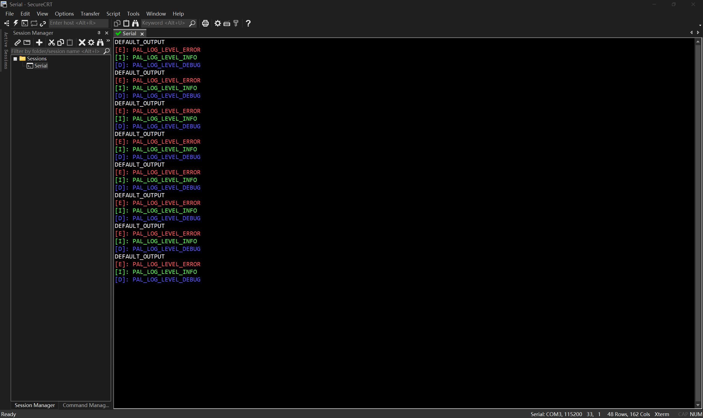

# 基于 STM32H743VITx 的工程模板

使用 STM32CubeMX 创建的 MDK-ARM(µVision5) 工程，主要有“阻塞延时”和“日志打印”的功能。

## 阻塞延时

用 DWT 实现的阻塞延时，需要先调用 `BSP_DWT_Init()` 进行初始化，之后便可以调用 `BSP_DWT_DelayUs()` 和 `BSP_DWT_DelayMs()` 函数进行阻塞延时操作。

## 日志打印

在 `pal_log.c` 中将串口重定向为 `printf`，可以直接调用 `printf()` 通过串口输出打印，也可以调用 `PAL_LOG()` 配合 SecureCRT 实现带有颜色的输出打印，更方便查看输出信息。

函数调用示例：

```c
printf("DEFAULT_OUTPUT\r\n");
PAL_LOG(PAL_LOG_LEVEL_ERROR,"PAL_LOG_LEVEL_ERROR");
PAL_LOG(PAL_LOG_LEVEL_INFO,"PAL_LOG_LEVEL_INFO");
PAL_LOG(PAL_LOG_LEVEL_DEBUG,"PAL_LOG_LEVEL_DEBUG");
```

SecureCRT 显示示例：


